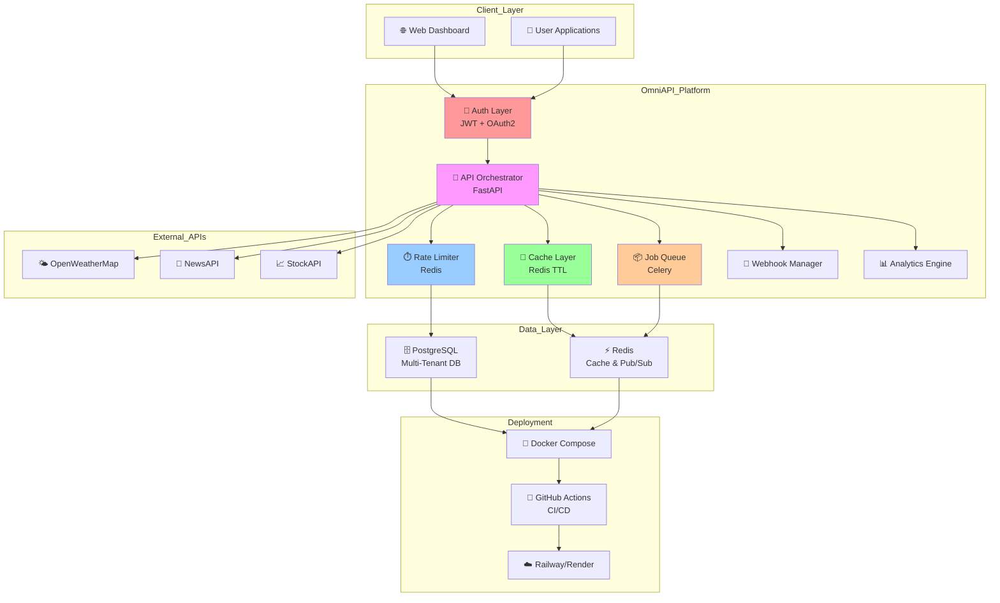
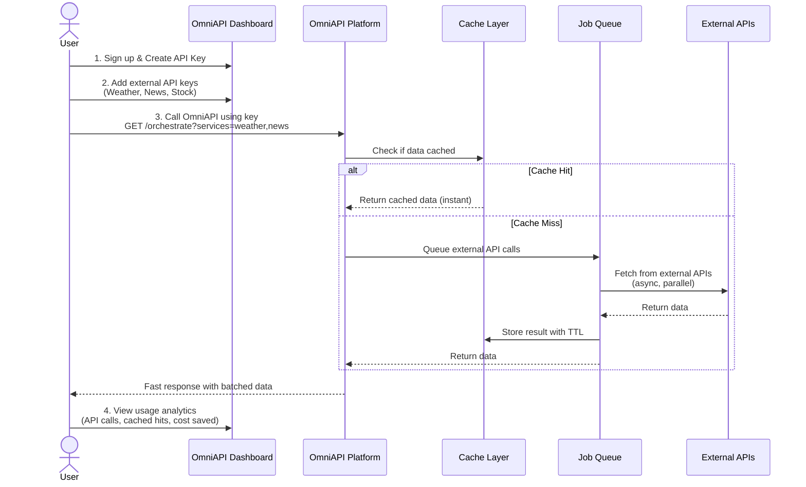
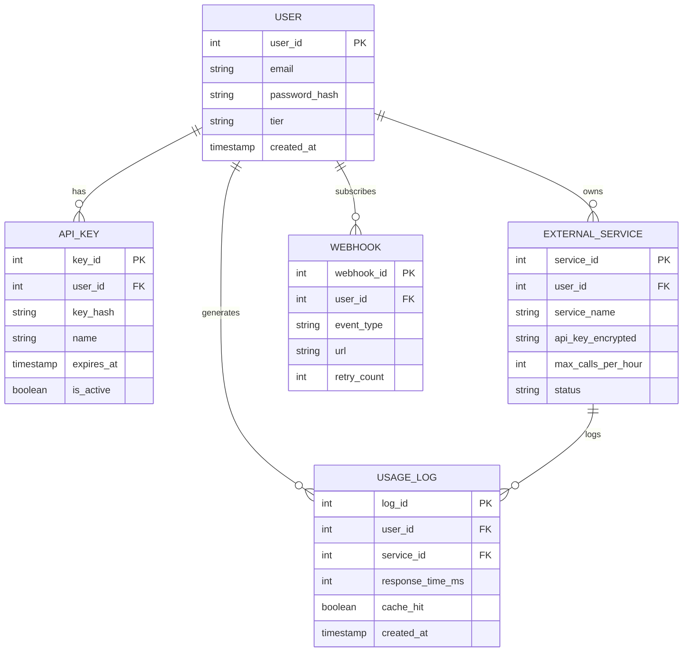

```
 ██████╗ ███╗   ███╗███╗   ██╗██╗ █████╗ ██████╗ ██╗
██╔═══██╗████╗ ████║████╗  ██║██║██╔══██╗██╔══██╗██║
██║   ██║██╔████╔██║██╔██╗ ██║██║███████║██████╔╝██║
██║   ██║██║╚██╔╝██║██║╚██╗██║██║██╔══██║██╔═══╝ ██║
╚██████╔╝██║ ╚═╝ ██║██║ ╚████║██║██║  ██║██║     ██║
 ╚═════╝ ╚═╝     ╚═╝╚═╝  ╚═══╝╚═╝╚═╝  ╚═╝╚═╝     ╚═╝
```


<div align="center">

[](https://omniapi3021.vercel.app)

</div>

---

## 🚀 Quick Summary

**OmniAPI** is a production-grade backend platform that lets users orchestrate calls to multiple external APIs through a single, intelligent interface. Instead of managing multiple API keys and hitting rate limits, users get **one API key from OmniAPI** and can intelligently call external services (weather, news, stocks, LLMs) with automatic **batching, caching, rate limiting, and async queuing**.

**Think of it as:** A smart traffic controller for API requests — making them faster, cheaper, and more reliable.

---

## 📋 The Problem

### Why Build This?
> - 🔑 **5+ API keys** scattered everywhere
> - ⚠️ **Rate limits** kill your workflow
> - 💰 **No caching** = wasted budget
> - 🐢 **Sequential calls** = slow responses
> - 👁️ **Zero visibility** into API usage
> - 🛠️ **Complex error handling** for each API
> - 🔒 **Blocking requests** tank performance

**Example Scenario:**
A SaaS product needs weather + news + stock data. Without OmniAPI:
- 3 different API keys to manage
- Hit rate limits independently
- Same data fetched 10x per hour = wasteful
- Calls happen sequentially = slow responses

---

## 🏗️ Architecture Overview

### System Design



---

## 🔑 How It Works (User Perspective)

### Workflow Diagram



---

## 💡 Key Design Decisions

### Decision 1: Multi-Tenant Architecture

**Problem:** How to safely serve multiple users without data leakage?

```
┌─────────────────┬──────────────────┐
│ DECISION        │ Multi-Tenant DB  │
├─────────────────┼──────────────────┤
│ TRADEOFF        │ More complex     │
│                 │ queries with     │
│                 │ tenant filtering │
├─────────────────┼──────────────────┤
│ RESULT          │ ✅ Scalable      │
│                 │ ✅ Cost-efficient│
│                 │ ✅ Data isolated │
└─────────────────┴──────────────────┘
```

**Implementation:**
- Every table has `tenant_id` foreign key
- Row-level security enforced in queries
- Tenants never see each other's data

---

### Decision 2: Redis for Caching + Rate Limiting

**Problem:** How to handle 1000s of requests/second without melting the database?

```
┌──────────────────┬──────────────────────┐
│ DECISION         │ Redis (In-Memory)    │
├──────────────────┼──────────────────────┤
│ TRADEOFF         │ Data lost on crash   │
│                  │ (but OK for cache)   │
├──────────────────┼──────────────────────┤
│ RESULT           │ ✅ Sub-millisecond   │
│                  │ ✅ Handles millions  │
│                  │ ✅ Perfect for TTL   │
└──────────────────┴──────────────────────┘
```

**What Redis Does:**
- **Rate Limiting:** "User A: 95/100 calls remaining"
- **Caching:** "Weather data expires in 1 hour"
- **Pub/Sub:** Real-time webhook events

---

### Decision 3: Celery for Async Jobs

**Problem:** Calling slow external APIs blocks responses for 5-10 seconds.

```
┌──────────────────┬──────────────────────┐
│ DECISION         │ Celery Task Queue    │
├──────────────────┼──────────────────────┤
│ TRADEOFF         │ More infrastructure  │
│                  │ (Celery + Redis)     │
├──────────────────┼──────────────────────┤
│ RESULT           │ ✅ Instant responses │
│                  │ ✅ No blocking calls │
│                  │ ✅ Retries + recovery
└──────────────────┴──────────────────────┘
```

**How It Works:**
```
User Request → Queue Job → Return Immediately → Process in Background
```

---

### Decision 4: PostgreSQL for Relational Data

**Problem:** Need to store users, API keys, external services, usage logs — all interconnected.

```
┌──────────────────┬──────────────────────┐
│ DECISION         │ PostgreSQL (SQL DB)  │
├──────────────────┼──────────────────────┤
│ TRADEOFF         │ Slower than NoSQL    │
│                  │ for simple reads     │
├──────────────────┼──────────────────────┤
│ RESULT           │ ✅ ACID guarantees   │
│                  │ ✅ Complex queries   │
│                  │ ✅ Data integrity    │
└──────────────────┴──────────────────────┘
```

---

## 📊 Data Models (Simplified)



---

## 🛠️ Tech Stack Deep Dive

| Component | Technology | Why This Choice |
|-----------|------------|-----------------|
| **Backend Framework** | FastAPI | Async-first, auto-docs, blazing fast |
| **Database** | PostgreSQL | ACID, relational data, proven at scale |
| **Cache/Queue Broker** | Redis | Sub-millisecond speed, pub/sub support |
| **Job Queue** | Celery | Distributed tasks, retries, scheduling |
| **ORM** | SQLAlchemy | Type hints, migration support, flexibility |
| **Auth** | JWT + OAuth2 | Stateless, industry standard |
| **Testing** | pytest | Fast, fixtures, 80%+ coverage goal |
| **Containerization** | Docker Compose | Dev/prod parity, easy scaling |
| **CI/CD** | GitHub Actions | Free, integrated with repos |
| **Deployment** | Railway/Render | Free tier, auto-scaling, painless |
---

## 🚀 Getting Started

### Prerequisites
```bash
✅ Python 3.11+
✅ Docker & Docker Compose
✅ PostgreSQL 15+
✅ Redis 7+
```