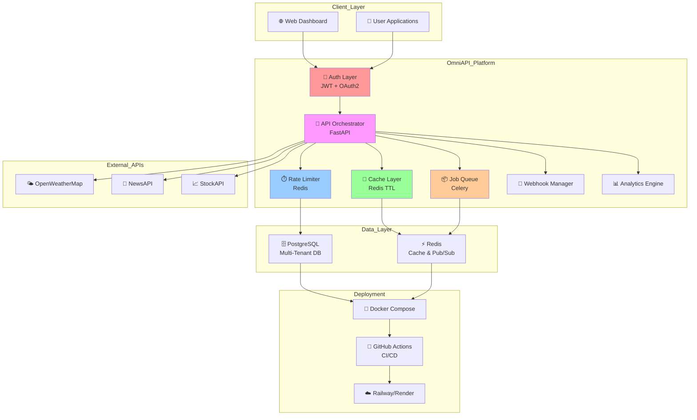
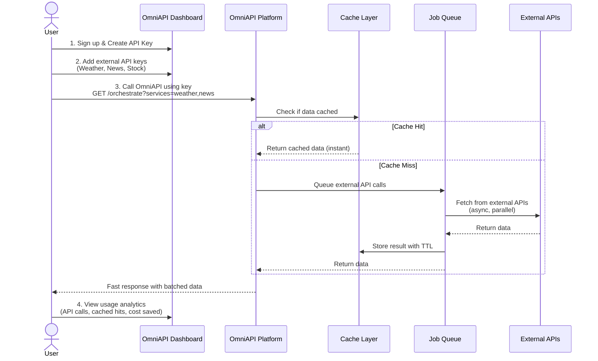
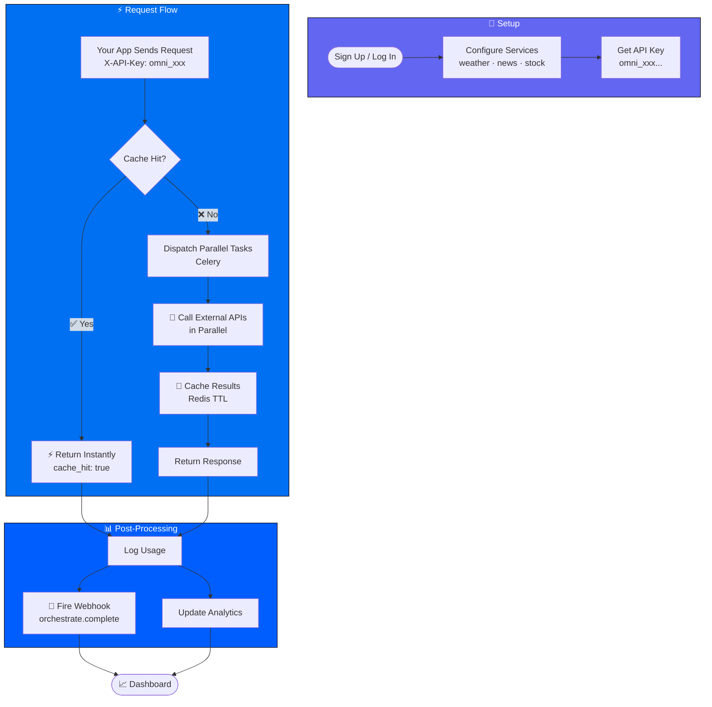
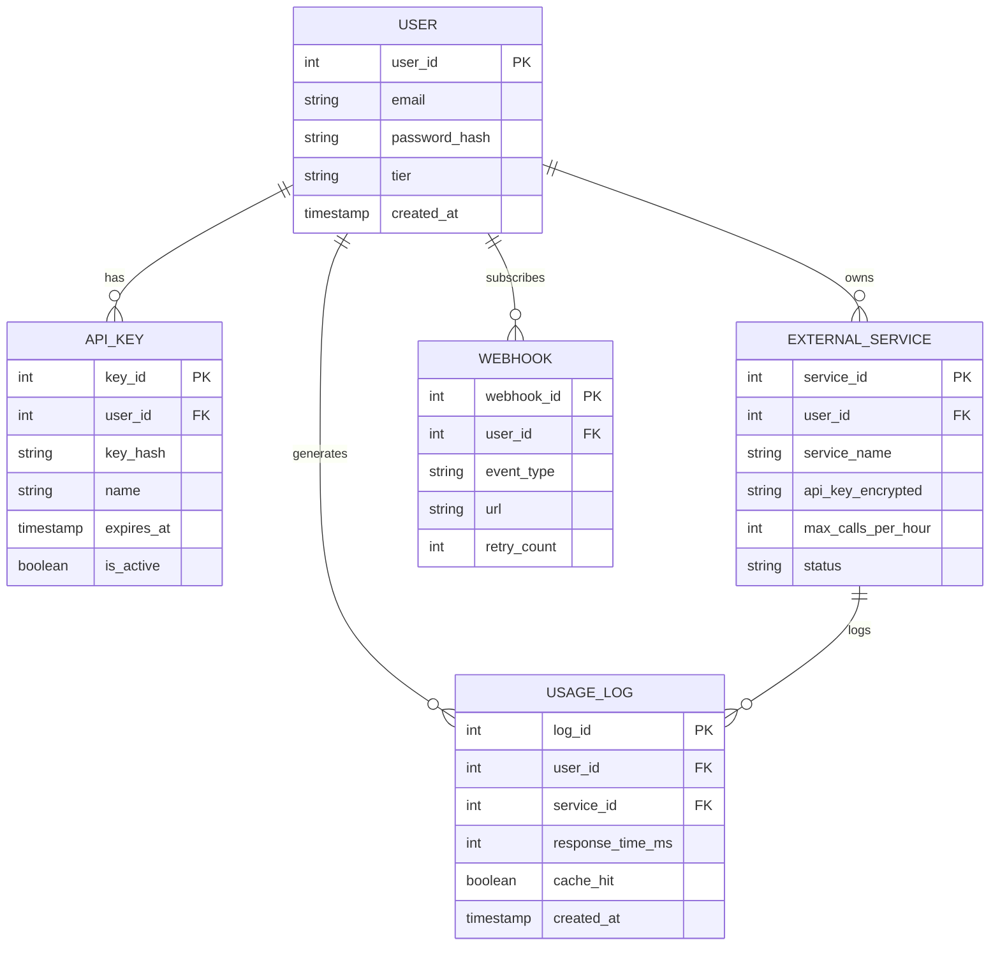

```
 ██████╗ ███╗   ███╗███╗   ██╗██╗ █████╗ ██████╗ ██╗
██╔═══██╗████╗ ████║████╗  ██║██║██╔══██╗██╔══██╗██║
██║   ██║██╔████╔██║██╔██╗ ██║██║███████║██████╔╝██║
██║   ██║██║╚██╔╝██║██║╚██╗██║██║██╔══██║██╔═══╝ ██║
╚██████╔╝██║ ╚═╝ ██║██║ ╚████║██║██║  ██║██║     ██║
 ╚═════╝ ╚═╝     ╚═╝╚═╝  ╚═══╝╚═╝╚═╝  ╚═╝╚═╝     ╚═╝
```


<div align="center">

[](https://omniapi3021.vercel.app)

</div>

---

## 🚀 Quick Summary

**OmniAPI** is a production-grade backend platform that lets users orchestrate calls to multiple external APIs through a single, intelligent interface. Instead of managing multiple API keys and hitting rate limits, users get **one API key from OmniAPI** and can intelligently call external services (weather, news, stocks, LLMs) with automatic **batching, caching, rate limiting, and async queuing**.

**Think of it as:** A smart traffic controller for API requests — making them faster, cheaper, and more reliable.

---

## 📋 The Problem

### Why Build This?
> - 🔑 **5+ API keys** scattered everywhere
> - ⚠️ **Rate limits** kill your workflow
> - 💰 **No caching** = wasted budget
> - 🐢 **Sequential calls** = slow responses
> - 👁️ **Zero visibility** into API usage
> - 🛠️ **Complex error handling** for each API
> - 🔒 **Blocking requests** tank performance

**Example Scenario:**
A SaaS product needs weather + news + stock data. Without OmniAPI:
- 3 different API keys to manage
- Hit rate limits independently
- Same data fetched 10x per hour = wasteful
- Calls happen sequentially = slow responses

---

## 🏗️ Architecture Overview

### System Design



---

## 🔑 How It Works (User Perspective)

### Workflow Diagram



---

## 👤 User Workflow

End-to-end guide — from signing up to making real orchestrated calls from your own application.

### Step 1 — Create an Account

Go to [omniapi3021.vercel.app](https://omniapi3021.vercel.app) and register.

```http
POST /api/v1/auth/register
Content-Type: application/json

{
  "full_name": "Jane Smith",
  "email": "jane@example.com",
  "password": "yourpassword"
}
```

Then log in to get your JWT token pair:

```http
POST /api/v1/auth/login
Content-Type: application/json

{
  "email": "jane@example.com",
  "password": "yourpassword"
}
```

```json
{
  "access_token": "eyJ...",
  "refresh_token": "eyJ..."
}
```

Use `access_token` as a `Bearer` token for all dashboard API calls. The dashboard refreshes it automatically via `POST /api/v1/auth/refresh` when it expires.

---

### Step 2 — Add Your External API Keys

OmniAPI calls third-party services **using your own API keys** for those providers. You register them once under External Services — they are AES-encrypted at rest and never returned in any response.

In the dashboard go to **External Services → Add Service**, or call:

```http
POST /api/v1/external-services
Authorization: Bearer <access_token>
Content-Type: application/json

{
  "service_name": "weather",
  "api_key": "your_openweathermap_key",
  "max_calls_per_hour": 100
}
```

Repeat for each service. Supported `service_name` values:

| Value | Provider | Get a key at |
|---|---|---|
| `weather` | OpenWeatherMap | [openweathermap.org/api](https://openweathermap.org/api) |
| `news` | NewsAPI | [newsapi.org](https://newsapi.org) |
| `stock` | StockAPI | your stock data provider |

**List configured services:**

```http
GET /api/v1/external-services
Authorization: Bearer <access_token>
```

```json
[
  {
    "service_id": 1,
    "service_name": "weather",
    "max_calls_per_hour": 100,
    "status": "active",
    "created_at": "2026-06-03T10:00:00Z"
  }
]
```

A service must be in `active` status before it can be orchestrated. You can pause it with `PATCH /api/v1/external-services/{id}` by setting `"status": "inactive"`, or remove it entirely with `DELETE /api/v1/external-services/{id}`.

---

### Step 3 — Generate an OmniAPI Key

Generate the key your **application** uses to authenticate with OmniAPI. In the dashboard go to **API Keys → Create Key**, or call:

```http
POST /api/v1/api-keys
Authorization: Bearer <access_token>
Content-Type: application/json

{
  "name": "Production App",
  "expires_at": "2027-01-01T00:00:00Z"
}
```

```json
{
  "key_id": 3,
  "name": "Production App",
  "raw_key": "omni_xK9mP2qL...",
  "is_active": true,
  "expires_at": "2027-01-01T00:00:00Z",
  "created_at": "2026-06-03T10:05:00Z"
}
```

> **`raw_key` is shown once only.** Copy it immediately and store it in your app's environment variables. It cannot be retrieved again.

Your application passes this key in the `X-API-Key` header on every orchestrate call.

---

### Step 4 — Make Orchestrated Calls

Send a single POST with the list of services you want and any per-service params. OmniAPI fans the calls out in parallel via Celery, caches results in Redis, and returns everything together.

```http
POST /api/v1/orchestrate
X-API-Key: omni_xK9mP2qL...
Content-Type: application/json

{
  "services": ["weather", "news"],
  "params": {
    "weather": { "city": "London" },
    "news":    { "q": "technology", "pageSize": 5 }
  }
}
```

```json
{
  "request_id": "a1b2c3d4-...",
  "total_time_ms": 312,
  "timestamp": "2026-06-03T10:10:00Z",
  "results": [
    {
      "service": "weather",
      "success": true,
      "cache_hit": false,
      "response_time_ms": 287,
      "data": { "city": "London", "temp_c": 18.4, "condition": "Partly cloudy" }
    },
    {
      "service": "news",
      "success": true,
      "cache_hit": true,
      "response_time_ms": 0,
      "data": { "articles": [ "..." ] }
    }
  ]
}
```

What to notice:

- `cache_hit: true` on `news` → served from Redis instantly, no external call made
- `cache_hit: false` on `weather` → fresh Celery task was dispatched and awaited
- `X-RateLimit-Remaining` response header tells you calls remaining in the current window
- A failed service returns `"success": false` with an `"error"` string; other services in the same request are unaffected
- Results are always ordered to match your `services` array

**Single-service call** — same shape, one item in `services`:

```json
{ "services": ["stock"], "params": { "stock": { "symbol": "AAPL" } } }
```

You can also authenticate with a `Bearer` JWT instead of `X-API-Key` when calling from a trusted server context.

---

### Step 5 — Monitor Usage in Analytics

Every orchestrated call is logged automatically. The **Analytics** page in the dashboard shows calls, cache hit rate, response times, and per-service breakdowns.

```http
GET /api/v1/analytics/summary
Authorization: Bearer <access_token>
```

```json
{
  "calls_today": 1420,
  "calls_change": 12.5,
  "cache_hit_percent": 67.3,
  "avg_response_ms": 184.0,
  "response_change_ms": -22.0
}
```

```http
GET /api/v1/analytics/usage?period=last_7d
Authorization: Bearer <access_token>
```

Valid `period` values: `last_24h` · `last_7d` · `last_30d`

Download a CSV report of the last 30 days:

```http
GET /api/v1/analytics/reports
Authorization: Bearer <access_token>
```

---

### Step 6 — Set Up Webhooks (Optional)

Subscribe to real-time events so your system reacts to orchestration outcomes without polling.

```http
POST /api/v1/webhooks
Authorization: Bearer <access_token>
Content-Type: application/json

{
  "url": "https://yourapp.com/hooks/omniapi",
  "event_type": "orchestrate.complete"
}
```

```json
{
  "webhook_id": 7,
  "url": "https://yourapp.com/hooks/omniapi",
  "event_type": "orchestrate.complete",
  "is_active": true,
  "retry_count": 0,
  "secret": "a3f9bc...",
  "created_at": "2026-06-03T10:15:00Z"
}
```

> **`secret` is shown once only.** Use it to verify the `X-OmniAPI-Signature` header on incoming payloads.

**Supported event types:**

| Event | Fires when |
|---|---|
| `orchestrate.complete` | All services in a request succeeded |
| `orchestrate.failed` | One or more services failed |
| `api_key.created` | A new OmniAPI key was generated |

**Payload your endpoint receives:**

```json
{
  "event_id": "uuid",
  "event_type": "orchestrate.complete",
  "tenant_id": "42",
  "timestamp": "2026-06-03T10:10:05Z",
  "data": {
    "request_id": "a1b2c3d4-...",
    "services": ["weather", "news"],
    "total_time_ms": 312,
    "results_summary": [
      { "service": "weather", "success": true,  "cache_hit": false },
      { "service": "news",    "success": true,  "cache_hit": true  }
    ]
  }
}
```

OmniAPI retries failed deliveries automatically. Check delivery history:

```http
GET /api/v1/webhooks/{webhook_id}
Authorization: Bearer <access_token>
```

Send a test ping to verify your endpoint is reachable:

```http
POST /api/v1/webhooks/{webhook_id}/test
Authorization: Bearer <access_token>
```

---

### Step 7 — Manage & Rotate Keys

**List all keys:**

```http
GET /api/v1/api-keys
Authorization: Bearer <access_token>
```

**Update a key's name or expiry:**

```http
PATCH /api/v1/api-keys/{key_id}
Authorization: Bearer <access_token>
Content-Type: application/json

{
  "name": "Production App v2",
  "expires_at": "2028-01-01T00:00:00Z"
}
```

**Permanently delete a key** (any app using it gets `401` immediately):

```http
DELETE /api/v1/api-keys/{key_id}
Authorization: Bearer <access_token>
```

For zero-downtime rotation: create the new key → update your app env var → delete the old key.

---

### Full Workflow at a Glance

---

## 💡 Key Design Decisions

### Decision 1: Multi-Tenant Architecture

**Problem:** How to safely serve multiple users without data leakage?

```
┌─────────────────┬──────────────────┐
│ DECISION        │ Multi-Tenant DB  │
├─────────────────┼──────────────────┤
│ TRADEOFF        │ More complex     │
│                 │ queries with     │
│                 │ tenant filtering │
├─────────────────┼──────────────────┤
│ RESULT          │ ✅ Scalable      │
│                 │ ✅ Cost-efficient│
│                 │ ✅ Data isolated │
└─────────────────┴──────────────────┘
```

**Implementation:**
- Every table has `tenant_id` foreign key
- Row-level security enforced in queries
- Tenants never see each other's data

---

### Decision 2: Redis for Caching + Rate Limiting

**Problem:** How to handle 1000s of requests/second without melting the database?

```
┌──────────────────┬──────────────────────┐
│ DECISION         │ Redis (In-Memory)    │
├──────────────────┼──────────────────────┤
│ TRADEOFF         │ Data lost on crash   │
│                  │ (but OK for cache)   │
├──────────────────┼──────────────────────┤
│ RESULT           │ ✅ Sub-millisecond   │
│                  │ ✅ Handles millions  │
│                  │ ✅ Perfect for TTL   │
└──────────────────┴──────────────────────┘
```

**What Redis Does:**
- **Rate Limiting:** "User A: 95/100 calls remaining"
- **Caching:** "Weather data expires in 1 hour"
- **Pub/Sub:** Real-time webhook events

---

### Decision 3: Celery for Async Jobs

**Problem:** Calling slow external APIs blocks responses for 5-10 seconds.

```
┌──────────────────┬──────────────────────┐
│ DECISION         │ Celery Task Queue    │
├──────────────────┼──────────────────────┤
│ TRADEOFF         │ More infrastructure  │
│                  │ (Celery + Redis)     │
├──────────────────┼──────────────────────┤
│ RESULT           │ ✅ Instant responses │
│                  │ ✅ No blocking calls │
│                  │ ✅ Retries + recovery
└──────────────────┴──────────────────────┘
```

**How It Works:**
```
User Request → Queue Job → Return Immediately → Process in Background
```

---

### Decision 4: PostgreSQL for Relational Data

**Problem:** Need to store users, API keys, external services, usage logs — all interconnected.

```
┌──────────────────┬──────────────────────┐
│ DECISION         │ PostgreSQL (SQL DB)  │
├──────────────────┼──────────────────────┤
│ TRADEOFF         │ Slower than NoSQL    │
│                  │ for simple reads     │
├──────────────────┼──────────────────────┤
│ RESULT           │ ✅ ACID guarantees   │
│                  │ ✅ Complex queries   │
│                  │ ✅ Data integrity    │
└──────────────────┴──────────────────────┘
```

---

## 📊 Data Models (Simplified)



---

## 🛠️ Tech Stack Deep Dive

| Component | Technology | Why This Choice |
|-----------|------------|-----------------|
| **Backend Framework** | FastAPI | Async-first, auto-docs, blazing fast |
| **Database** | PostgreSQL | ACID, relational data, proven at scale |
| **Cache/Queue Broker** | Redis | Sub-millisecond speed, pub/sub support |
| **Job Queue** | Celery | Distributed tasks, retries, scheduling |
| **ORM** | SQLAlchemy | Type hints, migration support, flexibility |
| **Auth** | JWT + OAuth2 | Stateless, industry standard |
| **Testing** | pytest | Fast, fixtures, 80%+ coverage goal |
| **Containerization** | Docker Compose | Dev/prod parity, easy scaling |
| **CI/CD** | GitHub Actions | Free, integrated with repos |
| **Deployment** | Railway/Render | Free tier, auto-scaling, painless |
---

## 🚀 Getting Started

### Prerequisites
```bash
✅ Python 3.11+
✅ Docker & Docker Compose
✅ PostgreSQL 15+
✅ Redis 7+
```